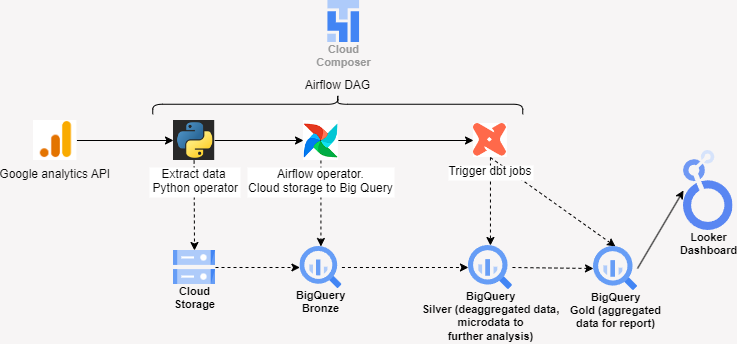

# Data reporting pipeline
The high level layout of this design is the following:



## Orchestration
The top-level component of this pipeline is an Airflow DAG that runs automatically once a week at a schedule convenient for the team and other processes. Airflow will be responsible for orchestrating and triggering all other processes in a coordinated manner. Airflow processes are expressed in DAGs saved in a configured Google Cloud Storage folder. This DAG will define the order of execution and the priorities of the pipeline processes.

```python
# Airflow DAG

default_args = {
    'owner': 'airflow',
    'depends_on_past': False,
    'start_date': days_ago(1),
    'retries': 1,
    'retry_delay': timedelta(minutes=5),
}

dag = DAG(
    'ga_to_bq',
    default_args=default_args,
    description='Extract data from Google Analytics, load into BigQuery and run dbt process',
    schedule_interval='0 0 * * 0',
    catchup=False,
)

def extract_ga_data(**kwargs):
   # request google analytics api and save the response as a dataset in GCS
   ...


with TaskGroup(group_id='extraction', dag=dag) as extraction:
    extract_task = PythonOperator(
        task_id='extract_ga_data',
        python_callable=extract_ga_data,
        dag=dag,
    )

    load_task = GCSToBigQueryOperator(
        task_id='load_ga_data_to_bq',
        bucket='bucket',
        source_objects=['ga_data/ga_data.csv'],
        destination_project_dataset_table='your_project.your_dataset.ga_data',
        schema_fields=[
            {'name': 'date', 'type': 'STRING', 'mode': 'NULLABLE'},
            {'name': 'country', 'type': 'STRING', 'mode': 'NULLABLE'},
            {'name': 'activeUsers', 'type': 'INTEGER', 'mode': 'NULLABLE'},
            {'name': 'newUsers', 'type': 'INTEGER', 'mode': 'NULLABLE'},
            # etc...
        ],
        write_disposition='WRITE_TRUNCATE',
        dag=dag,
    )
    extract_task >> load_task

with TaskGroup(group_id='run_dbt', dag=dag) as run_dbt:
    # As I don't know how dbt is deployed, I will assume is on the cloud and has dbt cloud api enabled
    trigger_dbt_cloud = SimpleHttpOperator(
        # trigger dbt job
        ...
    )
    check_dbt_job = HttpSensor(
        # check if the job is done
        ...
    )
    trigger_dbt_cloud >> check_dbt_job

extraction >> run_dbt
```

## Data extraction
1. Set up OAuth credentials to access the Google Analytics API. This involves coordinating with the team administrator to obtain the necessary credentials. 
2. Write a Python script that is triggered by an Airflow operator to fetch the API data, and save it to a temporary file in Cloud Storage.
3. Use an Airflow operator to load the dataset from the temporary file and save it to a BigQuery schema. Utilize a bronze, silver, and gold database strategy to differentiate between raw data and cleaner, more aggregated data. In this case, the dataset will be loaded into a table in the bronze database.

## Heavy data wrangling (if needed)
If the data wrangling and cleansing require substantial processing power, Google Dataproc can be used for heavy operations with Apache Spark. Apache Spark can handle parallel processing with many cores as needed. It is important to open and close Dataproc instances within the automated process to be resource-efficient. This can all be automated with Airflow.

## Data modeling
DBT is ideal for modeling the data in the bronze database.
1. Create schemas in Big Query
2. Create dbt models
    a. To adapt, clean and load the data into the silver database.
    b. To aggregate and filter the data for weekly reports and load it into the gold database.

A dbt model for the report can look like this (in this case i calculate percentual changes between weeks to make an example for the report):

```sql
with base as (
    select
        date_trunc('week', date) as week_start_date,
        sum(sessions) as sessions,
        sum(pageviews) as pageviews,
        sum(users) as users,
        avg(bounce_rate) as bounce_rate,
        avg(conversion_rate) as conversion_rate
    from {{ ref('bigQuey-silver-database-table') }}
    group by 1
),

week_over_week as (
    select
        week_start_date,
        sessions,
        pageviews,
        users,
        bounce_rate,
        conversion_rate,
        -- Absolute changes
        sessions - lag(sessions) over (order by week_start_date) as sessions_change,
        pageviews - lag(pageviews) over (order by week_start_date) as pageviews_change,
        users - lag(users) over (order by week_start_date) as users_change,
        bounce_rate - lag(bounce_rate) over (order by week_start_date) as bounce_rate_change,
        conversion_rate - lag(conversion_rate) over (order by week_start_date) as conversion_rate_change,
        -- Percentage changes
        100.0 * (sessions - lag(sessions) over (order by week_start_date)) / nullif(lag(sessions) over (order by week_start_date), 0) as sessions_change_pct,
        100.0 * (pageviews - lag(pageviews) over (order by week_start_date)) / nullif(lag(pageviews) over (order by week_start_date), 0) as pageviews_change_pct,
        100.0 * (users - lag(users) over (order by week_start_date)) / nullif(lag(users) over (order by week_start_date), 0) as users_change_pct,
        100.0 * (bounce_rate - lag(bounce_rate) over (order by week_start_date)) / nullif(lag(bounce_rate) over (order by week_start_date), 0) as bounce_rate_change_pct,
        100.0 * (conversion_rate - lag(conversion_rate) over (order by week_start_date)) / nullif(lag(conversion_rate) over (order by week_start_date), 0) as conversion_rate_change_pct
    from base
)

select * from week_over_week


```

## Reporting, dashboarding and more
- Google Looker can be connected to the reporting database to create a dashboard with real-time insights from the processed data.
- A Python script can be triggered by Airflow to run a Jupyter notebook with the updated data and save it or export it as pdf or html to Cloud Storage.
- Google Pub/Sub can connect this pipeline to any business messaging system (e.g., Slack) to notify when the weekly report is updated.